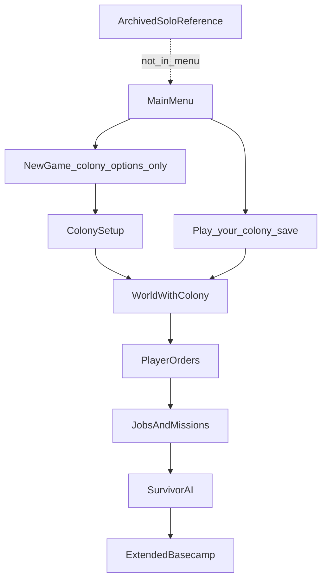

# Technical Design

## Goals

- Ship CULL as **the only** playable product path: colony sim New Game + Play your colony save.
- **New Game** = colony options only. **Play** = continue colony worlds only. No singleplayer survivor start or play option.
- **Archive** the old solo character path (code/docs kept as reference — see [Gameplay.md](Gameplay.md)).
- **Extend** basecamp, NPC jobs/activities, companion missions, construction, and savegame JSON rather than replacing them.
- Keep design docs under `doc/CULL/` as the source of truth for product decisions.

## Non-goals

- Keeping any singleplayer survivor start or Play path as a supported product option
- Rewriting core item, map, or combat simulation for colony play
- Introducing generic resource simulation as the authoritative economy ([Resources.md](Resources.md))

## Locked defaults (revisable only by updating this doc)

### Mode entry

- **New Game** presents **colony sim options only** and starts the colony setup → world flow (`src/main_menu.cpp` → `new_colony_tab`).
- **Play** / load / continue opens **colony world saves only** — worlds with `CULL_COLONY` (`load_colony_tab`).
- **Remove** all solo New Game submenu entries (Custom / Preset / Random / Play Now) from the live UI.
- Archive solo character creation (`src/newcharacter.cpp`, `src/character_creator_ui.h`) — not reachable as a play option; file-level ARCHIVED markers (Phase 7); still compiles for tests/tools.
- Tutorial removed from the main menu (no solo re-entry). `special_game` tutorial code may remain unused until archived.
- **Phase 7:** New Game runs `colony_setup_ui` (`src/colony_setup.*`) before world pick; options drive survivor count, NPC classes, gear crates, start location, and world difficulty.

### Colony substrate

- Player settlement = **extended faction basecamp** (`src/basecamp.*`, `src/faction_camp.*`), not a parallel camp system.
- **Phase 2:** New colony bootstraps via `talk_function::found_colony_camp` from `game::seed_colony_start`; starters become `NPC_MISSION_CAMP_RESIDENT`.

### Work

- **Local:** zones + `npc::job_data` + `ACT_MULTIPLE_*` (`src/activity_item_handling.cpp`).
- **Off-map:** companion missions (`src/mission_companion.*`); Colony Expeditions panel (`src/colony_expeditions.*`, action `colony_expeditions`).

### Items

- Real CDDA items/stocks only as simulation truth. UI aggregates allowed later if derived from items.

### Player control

- No direct survivor control as the default long-term play pattern. Leadership UI issues orders/priorities.
- **Avatar/camera:** **god-mode observer** — invisible immortal engine proxy for turns/save (`src/colony_camera.*`). All starters are camp NPCs. Movement keys pan camera; shared team FOV unions on-map residents/allies into `camera_cache`; `<`/`>` change Z freely; `control_npc` blocked; body DEFAULTMODE actions refused; craft → `colony_open_unified_crafting`; ENTER → `colony_survivors_ui`. Sidebar: ImGui `colony_sidebar` (width via `cull_colony_sidebar`). See [UI.md](UI.md).
- **Phase 2 leadership UI:** factions screen camp tab surfaces stock / residents / expansions (rough).
- **Phase 5 expeditions UI:** Colony Expeditions panel plans scout / loot / hunt / recruit companion missions.

### Colony world marker

- World option `CULL_COLONY` (hidden; set on Start Colony). Play lists only worlds with this flag.

## Architecture sketch

## Extension map

| Concern | Primary code / docs |
|---------|---------------------|
| Menu / new game | `src/main_menu.cpp`, `src/colony_setup.*`, `src/worldfactory.*` — New Game = colony options; Play = colony saves |
| Colony setup UI | `src/colony_setup.*` (Phase 7); archived contrast: `src/newcharacter.cpp` |
| Camp | `src/basecamp.*`, `src/faction_camp.*` (`found_colony_camp`), [BASECAMP.md](../JSON/BASECAMP.md) |
| Jobs | `job_data`, zones, `ACT_MULTIPLE_*` |
| Expeditions | `src/colony_expeditions.*`, `src/mission_companion.*`, [FACTION_MISSIONS.md](../JSON/FACTION_MISSIONS.md) |
| Construction | Blueprint recipes + `src/construction.*` + `src/colony_construction.*` |
| Combat / defense | `src/colony_combat.*`, `npc_follower_rules`, guard missions, `NPC_RETREAT` zones |
| Leadership hub | `src/colony_setup.*` (`colony_hub_menu`), action `colony_hub` |
| Survivors roster | `src/colony_survivors_ui.*`, action `colony_survivors` (ENTER) |
| God camera / team FOV / craft | `src/colony_camera.*`, `map::build_map_cache` team FOV union |
| Starter content | `data/json/cull/colony_starter_gear.json` |
| NPC AI | `src/npcmove.cpp`, behavior trees, [NPCs.md](../JSON/NPCs.md) |
| Saves | `src/savegame_json.cpp` — see [SaveSystem.md](SaveSystem.md) |
| Optional mode hooks | `src/gamemode.*`, EOCs ([EFFECT_ON_CONDITION.md](../JSON/EFFECT_ON_CONDITION.md)) |

## Compatibility

- Upstream-style JSON and C++ systems remain authoritative for shared mechanics.
- CULL-specific JSON/content should be clearly scoped when implementation begins.
- Preserve upstream Cataclysm documentation under `doc/` as system reference; CULL product design lives under `doc/CULL/`.
- Legacy solo saves: hidden from Play when missing `CULL_COLONY`; **refuse-with-message**, no auto-migrate ([SaveSystem.md](SaveSystem.md)).

## Solo code archive (Phase 7)

Live menu no longer reaches solo creation. Archive pass status:

1. `src/newcharacter.cpp` / `character_creator_ui.h` remain compiling for tests/tools; marked **ARCHIVED (CULL)** at file top.
2. Do not re-wire Custom / Preset / Random / Play Now / Tutorial into `main_menu`.
3. Keep [Gameplay.md](Gameplay.md) as the behavioral reference for the archived solo loop.
4. World “Character to Template” removed from the menu; template folder may remain for mods/tools.

## Related docs

- [UI.md](UI.md)
- [Gameplay.md](Gameplay.md)
- [SaveSystem.md](SaveSystem.md)
- [Roadmap.md](Roadmap.md)
- [TODO.md](TODO.md)
- [README.md](README.md)
